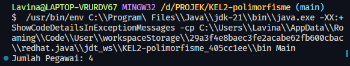
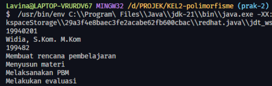
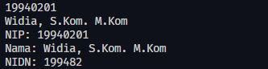

# Jobsheet 11 : Polimorfisme

**Kelompok 2**

- Dewi Sulistyowati/2341760126 <br>
- Johnatan David Gersom/2341760080 <br>
- Lavina/2341760062 <br>
- Marga Reta Novia Putri/2341760017 <br>
- Muhammad Mahdi Arielreza Hafiz/2341760049 <br>

### **Praktikum Bagian 1. Heterogenous Collection**

`Pegawai.java`

```java
public class Pegawai {
  String nip;
  String nama;

  public Pegawai() {

  }

  public Pegawai(String nip, String nama) {
    this.nip = nip;
    this.nama = nama;
  }

  public void displayInfo() {
    System.out.println("NIP: " + nip);
    System.out.println("Nama: " + nama);
  }
}
```

`Dosen.java`

```java
public class Dosen extends Pegawai {
  public String nidn;

  public Dosen() {

  }

  public Dosen(String nip, String nama, String nidn) {
    super(nip, nama);
    this.nidn = nidn;
  }

  public void displayInfo() {
    super.displayInfo();
    System.out.println("NIDN: " + nidn);
  }

  public void mengajar() {
    System.out.println("Membuat rencana pembelajaran");
    System.out.println("Menyusun materi");
    System.out.println("Melaksanakan PBM");
    System.out.println("Melakukan evaluasi");
  }
}
```

`TenagaKependidikan.java`

```java
public class TenagaKependidikan extends Pegawai {
  public String kategori;

  public TenagaKependidikan() {

  }

  public TenagaKependidikan(String nip, String nama, String kategori) {
    super(nip, nama);
    this.kategori = kategori;
  }

  public void displayInfo() {
    super.displayInfo();
    System.out.println("Kategori: " + kategori);
  }

}
```

`Main.java `

```java
import java.util.ArrayList;

public class Main {

    public static void main(String[] args) {
        Dosen dosen1 = new Dosen("19940201", "Widia, S.Kom. M.Kom", "199482");
        Dosen dosen2 = new Dosen("19700105", "Muhammad, S.T, M.T.", "197001");
        TenagaKependidikan tendik1 = new TenagaKependidikan("19750301", "Aida, A.Md.", "Tenaga Administratif");
        TenagaKependidikan tendik2 = new TenagaKependidikan("19650304", "Rika, S.T.", "Tenaga Laboratorium");

        ArrayList<Pegawai> daftarPegawai = new ArrayList<Pegawai>();
        daftarPegawai.add(dosen1);
        daftarPegawai.add(dosen2);
        daftarPegawai.add(tendik1);
        daftarPegawai.add(tendik2);

        System.out.println("Jumlah Pegawai: " + daftarPegawai.size());
    }
}
```

**Hasil Percobaan**<br>

<br>

### **Praktikum 2 : Object Casting**

1. Pada langkah sebelumnya, Anda telah membuat object dosen1 yang diinstansiasi dari class Dosen. Object dosen1 bertipe Dosen. Dengan kata lain, object tersebut akan dikenali/diperlakukan sebagai object bertipe Dosen. Oleh karena itu, dosen1 memiliki atribut NIDN dan dapat memanggil method mengajar() <br>
2. Modifikasi fungsi main() sebagai berikut: <br>

`Main.java`

```java
public class Main {
    public static void main(String[] args) {
        Dosen dosen1 = new Dosen(nip:"19940201", nama:"Widia, S.Kom. M.Kom", nidn:"199482");

        System.out.println(dosen1.nip);
        System.out.println(dosen1.nama);
        System.out.println(dosen1.nidn);
        dosen1.mengajar();
    }
}
```

3. Run dan compile kode program. Amati hasilnya.<br>
   **Hasil Percobaan**<br>

<br>

4. Lakukan upcasting object dosen1 menjadi object dari parent class nya, yaitu Pegawai. Object
   pegawai1 merupakan hasil instansiasi dari class Dosen, tetapi proses upcasting ini membuat
   pegawai1 dikenali dan diperlakukan sebagai object bertipe Pegawai.<br>

`Pegawai.java`

```java
Pegawai pegawai1 = dosen1;
```

5. Modifikasi kode program sebagai berikut: <br>
   `Main.java`

```java
Dosen dosen1 = new Dosen("19940201", "Widia, S.Kom. M Kom", "199402");

Pegawai pegawai1 = dosen1;

System.out.println(pegawai1.nip);
System.out.println(pegawai1.nama);
System.out.println(pegawai1.nidn);
pegawai1.mengajar();
```

6. Tidak ada compile error pada baris kode upcasting. Error muncul saat mengakses atribut NIDN dan memanggil method mengajar() karena object1 dikenali sebagai object bertipe Pegawai, sementara class Pegawai tidak memiliki atribut NIDN dan method mengajar() <br>

7. Modifikasi fungsi main sebagai berikut : <br>

`Main.java`

```java
Dosen dosen1 = new Dosen("19940201", "Widia, S.Kom. M Kom", "199402");

Pegawai pegawai1 = dosen1;

System.out.println(pegawai1.nip);
System.out.println(pegawai1.nama);
pegawai1.displayInfo();
```

8. Run dan compile kode program, amati hasilnya<br>

<br>

9. Perhatikan bahwa method displayInfo() dapat dipanggil oleh object pegawai1 karena terdapat method displayInfo() pada class Pegawai sehingga tidak muncul compile error. Tetapi saat program di-run, yang dieksekusi adalah method displayInfo() pada class Dosen, karena adanya overriding<br>

10. Cobalah lakukan downcasting object pegawai1 ke class TenagaKependididikan. Perhatikan bahwa downcasting harus dilakukan secara eksplisit dengan menyebutkan nama subclassnya. <br>

`Main.java`

```java
Dosen dosen1 = new Dosen("19940201", "Widia, S.Kom. M Kom", "199402");

Pegawai pegawai1 = dosen1;

System.out.println(pegawai1.nip);
System.out.println(pegawai1.nama);
pegawai1.displayInfo();

TenagaKependidikan test = (TenagaKependidikan) pegawai1;
```

11. Tidak terdapat warning pada kode program karena tidak ada compile error sebab TenagaKependidikan merupakan subclass dari class Pegawai.
12. Run program dan amati bahawa terdapat runtime error java.lang.ClassCastException kerena
    object tersebut bukan instance dari class TenagaKependidikan
13. Cobalah lakukan downcasting object pegawai1 kembali ke class Dosen.

**Penjelasan:** Kode yang ada didalam `<script>` menampilkan teks di konsol browser maupun di halaman browser.<br>

Tadi kita menuliskan perintah : <br>
<br>
Menurut Anda, mengapa perintah tersebut tidak ditampilkan? <br>

**Jawab:** Perintah tersebut tidak ditampilkan karena itu adalah kode yang hanya bisa menampilkan output di konsol browser..

### **Praktikum 3 : Cara Menulis Kode Javascript di HTML**

**1. Penulisan Kode Javascript dengan Embed**<br>
`hello_world.html`

```html
<!DOCTYPE html>
<html>
  <head>
    <title>Hello World Javascript</title>
    <script>
      console.log("Hello JS dari Head");
    </script>
  </head>
  <body>
    <p>Tutorial Javascript untuk pemula</p>
    <script>
      console.log("Saya belajar Javascript");
      document.write("Hello World!");
    </script>
  </body>
</html>
```

### Hasil Percobaan

<br>

Menurut Anda manakah yang lebih baik, dituliskan didalam tag `<head>` atau `<body>`?<br>
**Jawab:** Menurut saya script js sebaiknya ditempatkan tag `<body>` karena performanya lebih baik dan lebih cepat pemuatan halamannya.<br>

**2. Penulisan Kode Javascript Inline**<br>
`hello_world.html`

```html
<!DOCTYPE html>
<html>
  <head>
    <title>Hello World Javascript</title>
    <script>
      console.log("Hello JS dari Head");
    </script>
  </head>
  <body>
    <p>Tutorial Javascript untuk pemula</p>
    <a href="#" onclick="alert('Yey!')">Click Me!</a>
    <a href="javascript:alert('Yey!')">Click Me!</a>
    <script>
      console.log("Saya belajar Javascript");
      document.write("Hello World!");
    </script>
  </body>
</html>
```

### Hasil Percobaan

<br>

Apa yang membedakan dari kedua kode program tersebut? <br>
**Jawab:** Perbedaannya terdapat pada penulisannya saja dimana link yang pertama menggunakan event handler `onClick` dan link kedua menggunakan `javascript:alert('Yey!')` yang mana cara ini kurang disarankan karena membingungkan.<br>

**3. Penulisan Kode Javascript Inline**<br>
`kode-program.js`

```js
alert("Hello, ini adalah program js eksternal!");
```

`index.html`

```html
<!DOCTYPE html>
<html lang="en">
  <head>
    <title>Belajar Javascript dari nol</title>
  </head>
  <body>
    <p>Tutorial Javascript untuk pemula</p>
    <script src="kode-program.js"></script>
  </body>
</html>
```

### Hasil Percobaan

<br>
**Penjelasan:** Kode program js yang ada didalam `kode-program.js` akan dieksekusi saat halaman dibuka.<br>

Apa yang akan terjadi jika file javascript berada di folder yang berbeda?<br>
**Jawab:** Jika file javascript berada di folder yang berbeda maka tidak akan terjadi apapun karena file jsnya tidak terakses.<br>

### **Praktikum 4: Jendela Dialog**

`alert_javascript.html`

```html
<html>
  <head>
    <script type="text/javascript">
      function message() {
        alert("This alert box was called with the onload event");
      }
    </script>
  </head>
  <body onload="message()"></body>
</html>
```

### Hasil Percobaan

<br>
**Penjelasan:** Event `onload` berguna untuk mengeksekusi kode javascript ketika halaman pertama kali dimuat. Event tersebut menerima value berupa function `message()`.<br>

`confirm_javascript.html`

```html
<!DOCTYPE html>
<html lang="en">
  <head>
    <title>Dialog Confirm</title>
  </head>
  <body>
    <script>
      var yakin = confirm("Apakah kamu yakin akan mengunjungi polinema?");

      if (yakin) {
        window.location.href = "https://www.polinema.ac.id";
      } else {
        document.write("Baiklah, tetap disini saja ya :)");
      }
    </script>
  </body>
</html>
```

### Hasil Percobaan

<br>
<br>
**Penjelasan:** Kode di atas menampilkan dialog konfirmasi yang akan menggunakan fungsi `confirm()` yang menerima value berupa string. Jika user yakin akan mengunjungi polinema maka akan melakukan halaman yang diberikan pada `window.location.href`. Jika tidak akan mengunjungi maka akan menampilkan string lain.<br>

`prompt_javascript.html`

```html
<!DOCTYPE html>
<html lang="en">
  <head>
    <title>Dialog Prompt</title>
  </head>
  <body>
    <script>
      var nama = prompt("Siapa nama kamu");
      document.write("<p>Hello " + nama + "</p>");
    </script>
  </body>
</html>
```

### Hasil Percobaan

<br>
<br>

**Penjelasan:** Kode di atas menampilkan dialog prompt yang akan menggunakan fungsi `prompt()` yang menerima value berupa string lalu menampilkan string yang diberikan pada halaman web.

### **Praktikum 5: Variabel**

`variabel_javascript.html`

```html
<!DOCTYPE html>
<html lang="en">
  <head>
    <title>Belajar variabel dalam Javascript</title>
    <script>
      var name = "Javascript";
      var visitorCount = 50322;
      var isActive = true;

      alert("Selamat datang di " + name);

      document.write("Nama Situs: " + name + "<br>");
      document.write("Jumlah Pengunjung: " + visitorCount + "<br>");
      document.write("Status Aktif: " + isActive + "<br>");
    </script>
  </head>
  <body></body>
</html>
```

### Hasil Percobaan

<br>
<br>

**Penjelasan:** Kode diatas adalah cara mendeklarasi variabel di javascript, lalu menampilkan variabel tersebut di halaman web.

### **Praktikum 6 : FUNGSI**

`fungsi_javascript.html`

```html
<!DOCTYPE html>
<html lang="en">
  <head>
    <script>
      var sayHello = () => alert("Hello World!");
    </script>
  </head>
  <body>
    <a href="#" onclick="sayHello()">Klik Aku</a>
  </body>
</html>
```

### Hasil Percobaan

<br>
<br>

**Penjelasan:** Variabel juga bisa berisi sebuah fungsi.<br>

`fungsi_berparameter_javascript.html`

```html
<html>
  <head>
    <script type="text/javascript">
      function total(numberA, numberB) {
        return numberA + numberB;
      }
    </script>
  </head>
  <body>
    <script type="text/javascript">
      document.write(total(2, 3));
    </script>
    |
  </body>
</html>
```

### Hasil Percobaan

<br>

**Penjelasan:** Fungsi `total` menerima 2 parameter yaitu `numberA` dan `numberB` lalu hasilnya ditampilkan di halaman web.

### **Praktikum Bagian 7 : Tipe Data**

`tipedata_javascript.html`

```html
<!DOCTYPE html>
<body>
  <h2>Javascript Data Type</h2>

  <p>Contoh Javascript Data Types:</p>

  <p id="demo"></p>

  <script>
    var x;
    x=5;
    x="John";

    document.getElementById("demo").innerHTML=x;
  </script>
</body>
</html>
```

### Hasil Percobaan

<br>

**Penjelasan:** Kode script diatas menampilkan `John` karena variabel `x` terakhir diinisialisasi dengan nilai `John`. Lalu variabel tersebut dimasukkan ke tag html `p` dengan id `demo` dengan menggunakan fungsi `getElementById()` yang berguna untuk memanipulasi elemen html dengan `id` yang ditentukan.<br>

`string_javascript.html`

```html
<!DOCTYPE html>
<html>
  <body>
    <h2>Javascript String</h2>

    <p>Membuat Javascript String</p>

    <p id="demo"></p>

    <script>
      var answer1 = "It's alright";
      var answer2 = "He is called 'Dilan'";
      var answer3 = 'He is called "Dilan"';

      document.getElementById("demo").innerHTML =
        answer1 + "<br>" + answer2 + "<br>" + answer3;
    </script>
  </body>
</html>
```

### Hasil Percobaan

<br>
**Penjelasan:** Kode diatas memnunjukkan cara untuk menggabungkan value dari beberapa variabel.<br>

`boolean_javascript.html`

```html
<!DOCTYPE html>
<html lang="en">
  <body>
    <h2>Javascript Boolean</h2>

    <p>Boolean hanya memiliki nilai `true` dan `false`.</p>

    <p id="demo"></p>

    <script>
      var x = 5;
      var y = 5;
      var z = 6;

      document.getElementById("demo").innerHTML = (x == y) + "<br>" + (x == z);
    </script>
  </body>
</html>
```

### Hasil Percobaan

<br>
**Penjelasan:** Kode diatas adalah contoh penggunaan boolean dengan cara membandingkan 2 angka.<br>

`array_javascript.html`

```html
<!DOCTYPE html>
<html lang="en">
  <body>
    <h2>Javascript Arrays</h2>

    <p>Array</p>

    <p id="demo"></p>

    <script>
      var cars = ["Satu", "Dua", "Tiga"];

      document.getElementById("demo").innerHTML = cars[0];
    </script>
  </body>
</html>
```

### Hasil Percobaan

<br>
**Penjelasan:** Kode diatas adalah contoh penggunaan array yang menampilkan nilai dari array dengan index 0.

### **Praktikum Bagian 8: Praktikum 8: Operator**

`operator_javascript.html`

```html
<!DOCTYPE html>
<html lang="en">
  <body>
    <h2>Javascript Operator</h2>

    <p>x=5, y=2, menghitung z=x+y, dan tampil z:</p>
    <p id="demo"></p>

    <script>
      var x = 5;
      var y = 2;
      var z = x + y;

      document.getElementById("demo").innerHTML = z;
    </script>
  </body>
</html>
```

### Hasil Percobaan

<br>
**Penjelasan:** Kode script diatas menunjukkan cara melakukan penjumlahan.

### **Praktikum Bagian 9 : Percabangan**

`index.html`

```html
<!DOCTYPE html>
<html lang="en">
  <head>
    <title>Percabangan if</title>
  </head>
  <body>
    <script>
      var totalBelanja = prompt("Total belanja?", 0);

      if (totalBelanja > 30000) {
        document.write("<h2>Selamat Anda dapat hadiah</h2>");
      }

      document.write("<p>Terimakasih sudah berbelanja di toko kami</p>");
    </script>
  </body>
</html>
```

### Hasil Percobaan

<br>
<br>
**Penjelasan:** Kode diatas menunjukkan cara menggunakan if-else dengan script js.<br>

`ifelse_javascript.html`

```html
<!DOCTYPE html>
<html lang="en">
  <head>
    <title>Percabangan if-else</title>
  </head>
  <body>
    <script>
      var password = prompt("Password:");

      if (password == "teh") {
        document.write("<h2>Selamat datang !</h2>");
      } else {
        document.write("<p>Password salah, coba lagi!</p>");
      }
      document.write("<p>Terimakasih sudah menggunakan aplikasi ini!</p>");
    </script>
  </body>
</html>
```

### Hasil Percobaan

<br>
<br>
**Penjelasan:** Kode diatas menunjukkan cara menggunakan if-else dengan script js dengan contoh menggunakan inputan password.<br>

`switchcase_javascript.html`

```html
<!DOCTYPE html>
<html lang="en">
  <head>
    <title>Percabangan switch-case</title>
  </head>
  <body>
    <script>
      var jawab = prompt(
        "Kamu beruntung! Silakan pilih hadiahmu dengan memasukkan angka 1 sampi 5"
      );
      var hadiah = "";

      switch (jawab) {
        case "1":
          hadiah = "Tisu";
          break;
        case "2":
          hadiah = "1 kotak kopi";
          break;
        case "3":
          hadiah = "Sticker";
          break;
        case "4":
          hadiah = "Minyak Goreng";
          break;
        case "5":
          hadiah = "Uang Rp 50.000";
          break;
        default:
          document.write("<p>Opps! anda salah pilih</p>");
      }

      if (hadiah === "") {
        document.write("<p>Kamu gagal mendapat hadiah</p>");
      } else {
        document.write("<h2>Selamat kamu mendapatkan " + hadiah + "</h2>");
      }
    </script>
  </body>
</html>
```

### Hasil Percobaan

<br>
<br>
**Penjelasan:** Kode diatas menunjukkan cara menggunakan switch-case dengan script js dengan contoh pemilihan sebuah hadiah<br>

`nestedif_javascript.html`

```html
<!DOCTYPE html>
<html lang="en">
  <head>
    <title>Percabangan Ternary</title>
  </head>
  <body>
    <script>
      var username = prompt("Username:");
      var password = prompt("Password:");

      if (username == "mahasiswa") {
        if (password == "kopi") {
          document.write("<h2>Selamat Datang</h2>");
        } else {
          document.write("<p>Password salah, coba lagi!</p>");
        }
      } else {
        document.write("<p>Anda tidak terdaftar!</p>");
      }
    </script>
  </body>
</html>
```

### Hasil Percobaan

<br>
<br>
<br>
**Penjelasan:** Kode diatas menunjukkan cara menggunakan nested if-else dengan script js dengan contoh menggunakan inputan username dan password.<br>

### **Praktikum Bagian 10 : Perulangan**

`for_javascript.html`

```html
<!DOCTYPE html>
<html lang="en">
  <body>
    <h2>Javascript Loops</h2>

    <p id="demo"></p>

    <script>
      var text = "";
      var i;

      for (i = 0; i < 5; i++) {
        text += "The number is " + i + "<br>";
      }

      document.getElementById("demo").innerHTML = text;
    </script>
  </body>
</html>
```

### Hasil Percobaan

<br>

**Penjelasan:** Kode diatas menunjukkan cara menggunakan for-loop dengan script js yang menampilkan teks berisi angka yang urut.<br>

`while_javascript.html`

```html
<!DOCTYPE html>
<html lang="en">
  <body>
    <h2>Javascript While</h2>

    <p id="demo"></p>

    <script>
      var text = "";
      var i = 0;

      while (i < 10) {
        text += "The number is " + i;
        i++;
      }

      document.getElementById("demo").innerHTML = text;
    </script>
  </body>
</html>
```

### Hasil Percobaan

<br>
**Penjelasan:** Kode diatas menunjukkan cara menggunakan while-loop dengan script js yang menampilkan teks berisi angka yang urut.<br>

`do...while_javascript.html`

```html
<!DOCTYPE html>
<html lang="en">
  <body>
    <h2>Javascript do...while</h2>

    <p id="demo"></p>

    <script>
      var text = "";
      var i = 0;

      do {
        text += "<br>The number is " + i;
        i++;
      } while (i < 10);

      document.getElementById("demo").innerHTML = text;
    </script>
  </body>
</html>
```

### Hasil Percobaan

<br>
**Penjelasan:** Kode diatas menunjukkan cara menggunakan do-while loop dengan script js yang menampilkan teks berisi angka yang urut.<br>
